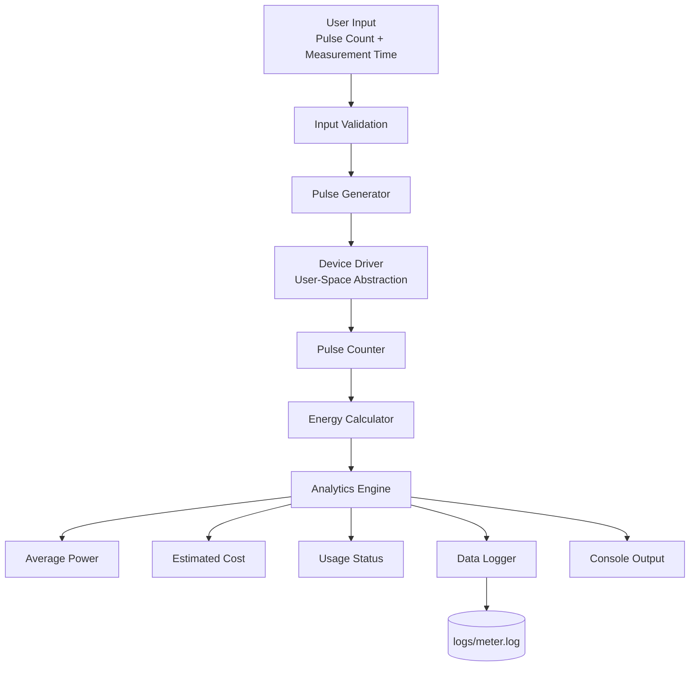
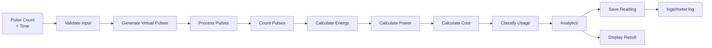

# Smart Energy Smart-Meter Pulse Counter & Analytics Agent

## Project Overview

The **Smart Energy Smart-Meter Pulse Counter & Analytics Agent** is a Linux-based C++11 application that simulates a smart electricity meter using virtual pulse readings.

The system accepts a pulse count and measurement time, processes the pulses, calculates energy consumption, average power and estimated cost, determines the usage level, and stores the reading in a log file.

---

## Objectives

- Simulate smart-meter pulse generation.
- Process pulses using a modular C++ design.
- Calculate energy consumption and average power.
- Estimate electricity cost.
- Classify energy usage.
- Validate user input.
- Store meter readings in a log file.
- Demonstrate Linux, C++ and Git-based development.

---

## System Architecture



> **Note:** The Device Driver is a user-space abstraction used for simulation. It is not a Linux kernel driver.

---

## Data Flow



---

## Main Features

- Virtual pulse generation.
- User-space device-driver abstraction.
- Pulse counting.
- Energy calculation.
- Average power calculation.
- Electricity cost estimation.
- Usage classification.
- Input validation.
- Basic energy analytics.
- File-based data logging.
- Modular C++11 implementation.
- Unit testing.
- Bash build script.

---

## Calculations

### Energy

The project uses a simulated conversion factor:

```text
1 pulse = 0.001 kWh
```

Therefore:

```text
Energy (kWh) = Pulse Count × 0.001
```

### Average Power

```text
Average Power (W) =
(Energy / Measurement Time) × 1000
```

### Estimated Cost

The project uses an assumed electricity rate of **₹8.00/kWh**.

```text
Estimated Cost = Energy × ₹8.00
```

### Usage Classification

```text
Below 500 W       → NORMAL
500–1000 W        → HIGH
Above 1000 W      → VERY HIGH
```

---

## Project Structure

```text
smart_meter_pulse_analytics/
│
├── include/
│   ├── analytics.h
│   ├── data_logger.h
│   ├── device_driver.h
│   ├── energy_calculator.h
│   ├── pulse_counter.h
│   └── pulse_generator.h
│
├── src/
│   ├── analytics.cpp
│   ├── data_logger.cpp
│   ├── device_driver.cpp
│   ├── energy_calculator.cpp
│   ├── main.cpp
│   ├── pulse_counter.cpp
│   └── pulse_generator.cpp
│
├── tests/
│   ├── test_analytics.cpp
│   ├── test_data_logger.cpp
│   ├── test_energy_calculator.cpp
│   └── test_pulse_counter.cpp
│
├── data/
├── docs/
├── logs/
├── scripts/
└── README.md
```

---

## Technologies

| Technology | Purpose |
|---|---|
| C++11 | Application development |
| Ubuntu Linux | Development platform |
| g++ | Compilation |
| Bash | Build automation |
| Git | Version control |
| GitHub | Repository hosting |
| File I/O | Meter data logging |

---

## Build and Run

### 1. Clone the repository

```bash
git clone https://github.com/N-Nischal/smart-meter-pulse-analytics.git
cd smart-meter-pulse-analytics
```

### 2. Build the project

```bash
./scripts/run.sh
```

The script compiles the main application and individual test programs using:

```text
-std=c++11
-Wall
-Wextra
```

### 3. Run the application

```bash
./smart_meter
```

### 4. Run the tests

```bash
./pulse_counter_test
./energy_calculator_test
./analytics_test
./data_logger_test
```

---

## Sample Execution

```text
Enter pulse count: 300
Enter measurement time (hours): 3

Pulse Count       : 300
Energy Used       : 0.30 kWh
Time Measured     : 3.00 hour
Average Power     : 100.00 W
Rate              : ₹8.00 / kWh
Estimated Cost    : ₹2.40
Usage Status      : NORMAL
Log File          : logs/meter.log
Reading Status    : SAVED
Meter Status      : RUNNING
```

---

## Testing

The project includes separate tests for the major modules.

| Test | Result |
|---|---|
| PulseCounter | PASS |
| EnergyCalculator | PASS |
| AnalyticsEngine | PASS |
| DataLogger | PASS |
| Valid Input | PASS |
| Invalid Pulse Input | PASS |
| Invalid Time Input | PASS |
| Build Verification | PASS |
| Log File Verification | PASS |

---

## Development Stages

The project was developed in six stages:

1. **Stage 1 – Introduction**
2. **Stage 2 – Requirements**
3. **Stage 3 – System Design**
4. **Stage 4 – Prototype / Implementation**
5. **Stage 5 – Testing**
6. **Stage 6 – Final Report**

Detailed documentation for each stage is available in the `docs/` directory.

---

## Limitations

- The meter is software-simulated and does not use physical hardware.
- The DeviceDriver is a user-space abstraction, not a kernel driver.
- The pulse-to-energy conversion factor is simulated.
- The electricity tariff is assumed.
- The application currently uses a command-line interface.
- Real-time hardware communication is not implemented.

---

## Future Improvements

- Real energy-meter or sensor integration.
- Microcontroller integration.
- Real Linux device-driver development.
- Real-time pulse acquisition.
- Database storage.
- Historical energy graphs.
- Graphical monitoring.
- Cloud-based monitoring.
- Configurable electricity tariffs.

---

## Repository

**GitHub:**  
https://github.com/N-Nischal/smart-meter-pulse-analytics

---

## Author

**N. Nischal**  
B.Tech Computer Science and Engineering  
ITER, SOA University

---

## Conclusion

This project demonstrates a complete software-based smart-meter workflow using **C++11 and Linux**. It combines virtual pulse processing, energy calculations, analytics, file logging, testing, Bash scripting and Git-based development in a modular application.
