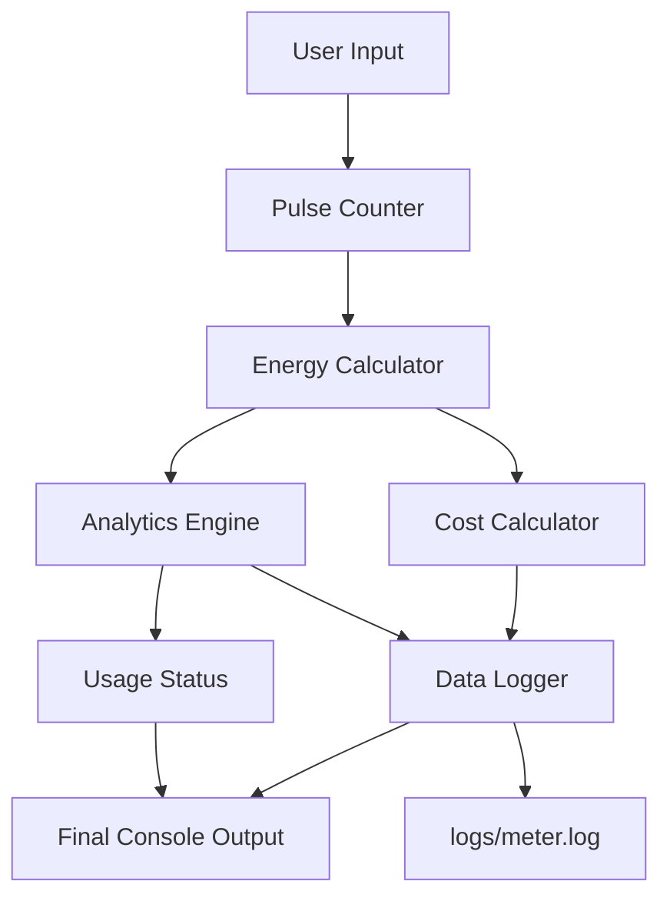
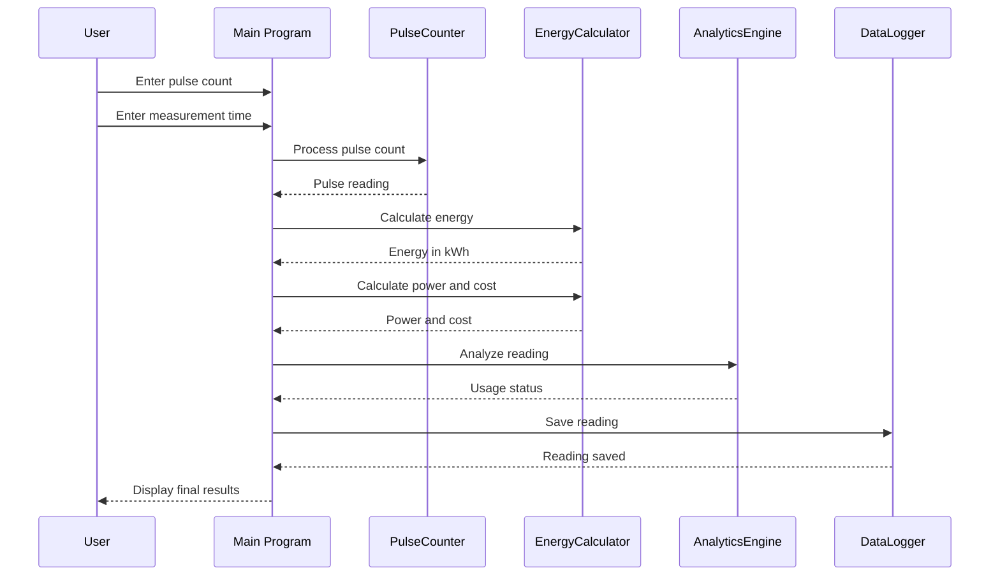
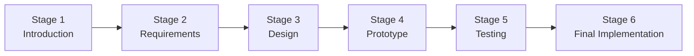

# Smart Energy Smart-Meter Pulse Counter & Analytics Agent

## Project Overview

The **Smart Energy Smart-Meter Pulse Counter & Analytics Agent** is a Linux-based C++ application that simulates a smart electricity meter using virtual pulse readings.

The system accepts a pulse count and measurement time, converts pulses into energy consumption, calculates average power and estimated cost, determines the usage status, and stores the reading in a log file.

The project demonstrates concepts from:

- C++ Programming
- Linux System Programming
- File I/O
- Object-Oriented Programming
- Modular Software Design
- Unit Testing
- Bash Scripting
- Software Development Life Cycle

---

## Objectives

- Simulate an electricity meter using virtual pulse input.
- Convert meter pulses into electrical energy.
- Calculate average power consumption.
- Estimate electricity cost.
- Analyze usage status.
- Store meter readings in a log file.
- Develop and test the system using Linux and C++.
- Follow a structured six-stage software development process.

---

## System Architecture



### Architecture Explanation

| Component | Responsibility |
|---|---|
| PulseCounter | Handles virtual meter pulse information |
| EnergyCalculator | Converts pulses into energy and calculates power/cost |
| AnalyticsEngine | Processes energy readings and calculates statistics |
| DataLogger | Stores readings in the log file |
| Main Program | Coordinates the complete system |

---

## Data Flow



---

## Energy Calculation

The project uses a virtual meter conversion factor:

**1 pulse = 0.001 kWh**

### Energy

```text
Energy = Pulse Count × 0.001
```

Example:

```text
300 pulses × 0.001 = 0.30 kWh
```

### Average Power

```text
Average Power = (Energy / Time) × 1000
```

Example:

```text
0.30 / 2 × 1000 = 150 W
```

### Estimated Cost

The project uses an assumed electricity tariff of:

```text
₹8 per kWh
```

Therefore:

```text
Cost = Energy × Tariff
```

Example:

```text
0.30 × ₹8 = ₹2.40
```

---

## Main Features

### 1. Pulse Counting

The `PulseCounter` module handles the virtual meter pulse count.

### 2. Energy Calculation

The `EnergyCalculator` converts pulses into kWh and calculates average power.

### 3. Energy Analytics

The `AnalyticsEngine` stores energy readings and calculates total and average energy.

### 4. Cost Estimation

The system estimates electricity cost using the configured tariff.

### 5. Usage Classification

The system classifies consumption according to the configured usage thresholds.

### 6. Data Logging

The `DataLogger` stores readings in:

```text
logs/meter.log
```

Example:

```text
300,0.3
600,0.6
900,0.9
```

---

## Project Structure

```text
smart-meter-pulse-analytics/
│
├── README.md
├── .gitignore
│
├── docs/
│   ├── stage1_introduction.md
│   ├── stage2_requirements.md
│   ├── stage3_design.md
│   ├── stage4_prototype.md
│   ├── stage5_testing.md
│   └── stage6_final_report.md
│
├── include/
│   ├── analytics.h
│   ├── data_logger.h
│   ├── energy_calculator.h
│   └── pulse_counter.h
│
├── scripts/
│   └── run.sh
│
├── src/
│   ├── analytics.cpp
│   ├── data_logger.cpp
│   ├── energy_calculator.cpp
│   ├── main.cpp
│   └── pulse_counter.cpp
│
└── tests/
    ├── test_analytics.cpp
    ├── test_data_logger.cpp
    ├── test_energy_calculator.cpp
    └── test_pulse_counter.cpp
```

---

## Technologies Used

- **Language:** C++
- **Standard:** C++11
- **Operating System:** Ubuntu/Linux
- **Compiler:** g++
- **Testing:** C++ unit-test programs
- **Shell:** Bash

---

## Requirements

The project requires:

- Ubuntu/Linux
- GNU g++
- C++11 support
- Bash

Check the compiler:

```bash
g++ --version
```

---

# Step-by-Step: How to Run the Project

This section explains how to run the project from the beginning.

## Step 1 — Open the Terminal

Open a terminal in Ubuntu/Linux.

---

## Step 2 — Clone the Project

Clone the GitHub repository:

```bash
git clone https://github.com/N-Nischal/smart-meter-pulse-analytics.git
```

---

## Step 3 — Enter the Project Directory

```bash
cd smart-meter-pulse-analytics
```

---

## Step 4 — Check the Project Files

You can check the project structure using:

```bash
find . -maxdepth 3 -type f | sort
```

You should see the source files, header files, tests, documentation, and build script.

---

## Step 5 — Build the Project

Run the build script:

```bash
./scripts/run.sh
```

The script compiles:

- The main smart-meter application
- Pulse Counter test
- Energy Calculator test
- Analytics test
- Data Logger test

If the build is successful, you will see:

```text
Build completed successfully.
```

---

## Step 6 — Run the Smart Meter

Start the application:

```bash
./smart_meter
```

The program will ask for:

```text
Enter pulse count:
Enter measurement time (hours):
```

Enter the required values.

For example:

```text
Enter pulse count: 300
Enter measurement time (hours): 2
```

---

## Step 7 — View the Results

The application calculates and displays:

- Pulse count
- Energy consumed
- Measurement time
- Average power
- Electricity tariff
- Estimated cost
- Usage status
- Log file location
- Reading status

Example:

```text
========================================
          SMART ENERGY METER
========================================

Starting meter simulation...

Enter pulse count: 300
Enter measurement time (hours): 2

        ENERGY METER ANALYTICS

Pulse Count       : 300
Energy Used       : 0.30 kWh
Time Measured     : 2.00 hour
Average Power     : 150.00 W
Rate              : ₹8.00 / kWh
Estimated Cost    : ₹2.40
Usage Status      : NORMAL

Log File          : logs/meter.log
Reading Status    : SAVED

Meter Status      : RUNNING
```

---

## Step 8 — Check the Logged Reading

The meter reading is stored in:

```text
logs/meter.log
```

To view the file:

```bash
cat logs/meter.log
```

You can also display the latest entries:

```bash
tail -n 5 logs/meter.log
```

Example:

```text
300,0.3
600,0.6
900,0.9
```

---

## Step 9 — Run the Unit Tests

After building the project, run the individual tests.

### Pulse Counter Test

```bash
./pulse_counter_test
```

Expected:

```text
PulseCounter test passed
```

### Energy Calculator Test

```bash
./energy_calculator_test
```

Expected:

```text
EnergyCalculator test passed
```

### Analytics Test

```bash
./analytics_test
```

Expected:

```text
Total Energy: 46
Average Energy: 15.3333
```

### Data Logger Test

```bash
./data_logger_test
```

Expected:

```text
DataLogger test passed
```

---

## Step 10 — Complete Basic Verification

A simple complete verification sequence is:

```bash
./scripts/run.sh
./pulse_counter_test
./energy_calculator_test
./analytics_test
./data_logger_test
./smart_meter
```

This builds the project, executes the unit tests, and finally starts the smart-meter application.

---

## Testing

The project contains separate tests for the main modules:

| Module | Test Program | Result |
|---|---|---|
| PulseCounter | `pulse_counter_test` | Passed |
| EnergyCalculator | `energy_calculator_test` | Passed |
| AnalyticsEngine | `analytics_test` | Passed |
| DataLogger | `data_logger_test` | Passed |

The tests verify the basic functionality of the individual modules before and during integration.

---

## Development Process

The project follows the six stages specified for the individual training project.



### Stage 1 — Project Introduction

Project idea, problem statement, scope, objectives, expected outcome, and application.

### Stage 2 — Requirements & Development Plan

Functional requirements, non-functional requirements, modules, features, deliverables, and development planning.

### Stage 3 — System Design & Architecture

System architecture, components, data structures, UML/design documentation, implementation plan, and development environment.

### Stage 4 — Initial Implementation & Prototype

Core C++ modules, initial integration, working prototype, and development issues.

### Stage 5 — Testing, Integration & Improvement

Unit testing, integration testing, debugging, reliability improvements, and code quality.

### Stage 6 — Final Implementation & Presentation

Final working system, testing results, documentation, limitations, achievements, and future improvements.

---

## Linux and System Programming Concepts

The project demonstrates:

- Linux command-line development
- C++ compilation using `g++`
- Bash scripting
- File handling
- File-based data logging
- Executable generation
- Modular source-code organization
- Process execution

The current implementation is a **user-space Linux application** and does not contain a Linux kernel device driver or physical meter hardware.

---

## Limitations

- The meter input is simulated rather than obtained from physical hardware.
- No physical energy sensor is connected.
- The electricity tariff is an assumed value.
- Data is stored locally rather than in a cloud platform.
- The current implementation does not contain a Linux kernel device driver.
- The current analytics functionality provides basic energy statistics.

---

## Future Improvements

Possible future extensions include:

- Real energy sensor integration
- Linux device-driver interface
- Serial/USB communication
- MQTT-based communication
- Cloud data storage
- Real-time monitoring dashboard
- Database integration
- Multiple-meter support
- More advanced energy-consumption analytics
- Alert and notification system

---

## Documentation

Complete project documentation is available in the `docs/` directory:

```text
Stage 1 → Project Introduction
Stage 2 → Requirements & Development Plan
Stage 3 → System Design & Architecture
Stage 4 → Initial Implementation & Prototype
Stage 5 → Testing, Integration & Improvement
Stage 6 → Final Implementation & Presentation
```

Each stage contains the corresponding project documentation and development information.

---

## Project Status

**Development Status: Completed**

The final implementation includes:

- Working smart-meter simulation
- Pulse counting
- Energy calculation
- Average power calculation
- Cost estimation
- Usage classification
- Energy analytics
- Data logging
- Unit tests
- Automated build script
- Six-stage documentation


## Author

**N. Nischal**

B.Tech — Computer Science & Engineering  
ITER, Siksha 'O' Anusandhan

---

## Conclusion

The Smart Energy Smart-Meter Pulse Counter & Analytics Agent provides a simple software-based simulation of a smart electricity meter using C++ on Linux.

The system demonstrates pulse counting, energy conversion, average power calculation, cost estimation, usage classification, energy analytics, data logging, modular programming, unit testing, and automated build execution.

The project was developed through a structured six-stage process covering project introduction, requirements, system design, prototype development, testing and improvement, and final implementation.

The completed application provides a working foundation that can be extended in the future with physical sensors, device interfaces, real-time monitoring, cloud connectivity, and more advanced analytics.

